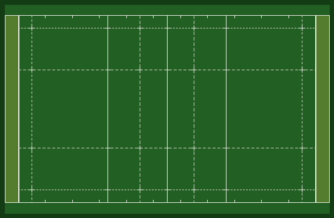

# RugbySim

**RugbySim** is a 15-a-side rugby-union simulator and machine-learning dataset
generator. It reuses the rendering + RL scaffolding of Google Research's
`google-research/football` engine but replaces the match logic, referee,
AI, set-piece handling, and visual assets with rugby equivalents.

The primary goal is to produce **training-data** (broadcast-style
video + per-frame bounding-box annotations + event timelines) for
computer-vision and analytics models, in the exact schema used by
human-annotated real-match footage.

<p align="center">
  
</p>

---

## What's rugby, not football

| Area | Change |
|---|---|
| **Laws & scoring** | Try (5), conversion (2, animated kick), drop goal (3, detected in open play), penalty goal (3, replaces football penalty on ruck offside). Forward-pass and knock-on detection with post-infringement scrum. |
| **Set pieces** | Rugby scrum (3-2-3 bound pack, visible front-row bind), lineout (2-phase throw arc with probabilistic jump contest), kickoff restart after any score. Post-scrum dispersal so packs don't freeze. |
| **Open play** | Ball is *carried in hands* at chest height — no foot dribbling. Auto-pickup of loose balls within 1.2 m. Backward-only passes via `TryRugbyPass`. Carrier sprints toward opposition try line; support players form a backward pod; defenders hold a flat line; nearest defender tackles. Auto-offload when cornered. Occasional kick-to-touch when deep in own half → triggers a lineout. |
| **Goalkeeper** | Removed. All 15 players per team wear the same team jersey and play as outfielders. |
| **Pitch markings** | Rugby field overlay: halfway, 22 m solid, 10 m dashed, 5 m / 15 m dotted insets, tick crosses at intersections, touchline hash marks, dead-ball lines, in-goal shading. Football centre circle and penalty boxes removed. |
| **Visuals** | Oval ball mesh, H-post goalposts (procedurally generated `goals.ase`), hooped team jerseys (red vs navy/white), rugby-field radar/minimap. |
| **Obs space** | Adds `rugby_breakdown_active`, `rugby_scrum_active`, `rugby_lineout_active`, breakdown position, offside line, scrum/lineout winners, actual time, and `camera_*` for 3D→2D projection. |

Details of the engine rewrite plan are in
[`docs/ENGINE_REWRITE_PLAN.md`](docs/ENGINE_REWRITE_PLAN.md).

---

## Install

The native engine is built from source via CMake. On macOS/Linux:

```bash
python3 -m venv .venv
source .venv/bin/activate
python3 -m pip install --upgrade pip wheel setuptools
python3 -m pip install -e .
```

The build script (`gfootball/build_game_engine.sh`) compiles the C++
engine and produces `libgame.dylib` / `_gameplayfootball.so` inside
`third_party/gfootball_engine/`. `setup.py develop` creates a
`gfootball_engine/` symlink at the repo root so Python can import it.

Prerequisites: CMake, SDL2, Boost. On macOS via Homebrew:
```bash
brew install cmake sdl2 sdl2_image sdl2_ttf sdl2_gfx boost
```

---

## Quick start

```python
from rugby_sim import create_environment

env = create_environment(render=False)
env.reset()
obs, reward, done, info = env.step([0] * 15)
```

Scenarios available (all 15 v 15, rugby action set):

```python
from rugby_sim import (
    create_environment,                     # full match
    create_try_restart_test_environment,    # starts with a forced try
    create_breakdown_test_environment,      # starts at a ruck
    create_scrum_test_environment,          # starts at a scrum
    create_lineout_test_environment,        # starts at a lineout
    create_forward_pass_test_environment,   # forces a forward-pass scrum
    create_knock_on_test_environment,       # forces a knock-on scrum
)
```

Rugby action set (index 0 – 22): `idle`, 8 directional arrows,
`rugby_pass`, `spin_pass`, `box_kick`, `grubber_kick`, `tackle`,
`contest`, `bind`, `offload`, `sprint`, `release_*`. See
`rugby_sim/action_set.py`.

---

## Training-data pipeline

Generate broadcast-style video + per-frame bounding-box annotations
matching the schema used by human-annotated real footage:

```bash
python tools/generate_training_data.py --matches 50 --steps 1200 \
    --fov 22 --height 18 --back-offset 55 \
    --out ./dataset --render
```

Per match you get:

```
dataset/match_NNN/
├── match_NNN.mp4                  # rendered broadcast video
├── match_NNN.json                 # per-frame xyxy bbox annotations
├── match_NNN_events.jsonl         # try/scrum/lineout/breakdown timeline
└── summary.json                   # score + event counts
dataset/index.json                 # aggregate across all matches
```

**Annotation schema** (identical to the public real-match annotation format used
by human annotators):

```json
{
  "video": "match_000.mp4",
  "fps": 10,
  "num_frames": 1200,
  "width": 1920,
  "height": 1080,
  "bbox_format": "xyxy",
  "coordinates": "absolute_pixels",
  "frames": [
    {
      "frame_number": 0,
      "objects": [
        {"bbox": [x1,y1,x2,y2], "class_id": 2, "class": "player",
         "team": "team_1", "jersey_number": 5},
        {"bbox": [x1,y1,x2,y2], "class_id": 3, "class": "player",
         "team": "team_2", "jersey_number": 12},
        {"bbox": [x1,y1,x2,y2], "class_id": 0, "class": "ball",
         "team": null, "jersey_number": null}
      ]
    }
  ]
}
```

Class IDs: `0 = ball`, `1 = referee` (reserved, not yet emitted),
`2 = player team_1`, `3 = player team_2`.

**Event timeline** (JSON-lines): `try`, `conversion`, `try_and_conversion`,
`kick_goal`, `breakdown_start/end`, `scrum_start/end` (with `winner`),
`lineout_start/end` (with `winner`), `game_mode` transitions,
`possession_change`.

---

## QA

Run the single-command health check to verify the sim is ready for
dataset generation:

```bash
python tools/qa_report.py
```

Runs 9 deep checks — scenario smoke, 3000-step stability, jersey
identity, bbox geometry (in-frame + finite), determinism, pipeline
schema, event-rate sanity, ball tracking, Exeter-Newcastle-schema
compatibility. Expected output: `VERDICT: READY`.

---

## Camera projection

`tools/project_bboxes.py` projects 3-D world positions to 2-D pixel
boxes in any of the broadcast camera configurations. Useful outside of
the dataset pipeline:

```python
from tools.project_bboxes import broadcast_camera_from_obs, frame_bboxes

cam = broadcast_camera_from_obs(obs, fov_deg=22.0,
                                 height=18.0, back_offset=55.0,
                                 width=1920, height_px=1080)
bboxes = frame_bboxes(obs, cam)
# [{'class':'player','team':'team_1','jersey_number':5,'bbox':[...]}, ...]
```

The engine's own follow-camera is exposed via `camera_from_obs(obs)`
(live tracking of ball + attacking player), but the deterministic
broadcast camera is recommended for reproducible datasets.

---

## Tools directory

| Tool | Purpose |
|---|---|
| `tools/generate_training_data.py` | N-match dataset with video + JSON + events |
| `tools/generate_rugby_dataset.py` | Lighter-weight per-step parquet + event log |
| `tools/project_bboxes.py` | 3-D → 2-D pixel-bbox helpers |
| `tools/qa_report.py` | Single-command readiness check |
| `tools/render_clip.py` / `render_clip_15s.py` / `render_clip_30s.py` / `render_open_play_15s.py` | Standalone video renders |
| `tools/generate_rugby_goals_ase.py` | H-post mesh generator (`goals.ase`) |
| `tools/generate_rugby_kits.py` | Hooped jersey BMP generator |
| `tools/generate_rugby_radar.py` | Rugby minimap BMP generator |
| `tools/ovalize_ball_ase.py` | Oval rugby-ball mesh generator |

---

## Tests

```bash
# All 7 scenarios run clean:
python tools/qa_report.py

# Individual smoke test:
python -c "from rugby_sim import create_environment; \
           env = create_environment(render=False); env.reset(); \
           [env.step([0]*15) for _ in range(100)]; print('ok')"
```

---

## Attribution

RugbySim is a fork of
[`google-research/football`](https://github.com/google-research/football),
which itself builds on Bastiaan Konings Schuiling's *Gameplay Football*
engine. See [`UPSTREAM.md`](UPSTREAM.md) for provenance and
[`NOTICE`](NOTICE) for the formal attribution. Licensed under Apache 2.0
— see [`LICENSE`](LICENSE).

Modified files retain their original Google LLC / Bastiaan Konings
copyright headers. New rugby-specific files are Apache 2.0 under the
top-level repository copyright.
